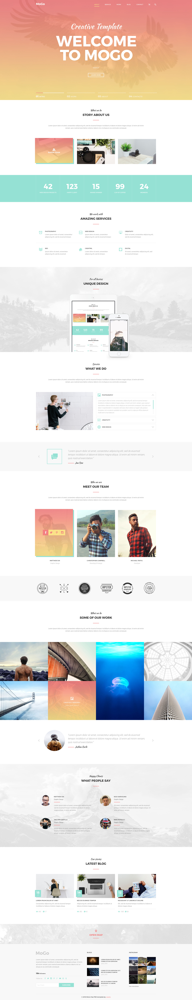

# Site MoGo

Este site fictício foi montado com base em um layout disponibilizado gratuitamente em um banco de imagens por Laaqiq (baixei esse layout há muito tempo atrás, por isso não lembro qual foi o banco de imagens e nem tenho conexão com Laaqiq para conceder os créditos).

Utilizei as seguintes ferramentas para a montagem do site:
- HTML5
- CSS3
- jQuery (JavaScript)

O site é responsivo, se adapta a vários tamanhos de tela.

Este é o layout:
